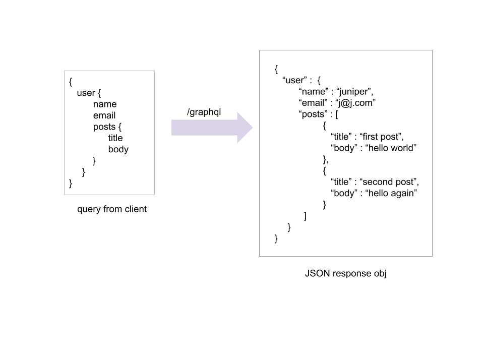

# GraphQL
**Prerequisite:** 
- Amplify? is a frontend library that makes it easier to talk to AWS backend resources
- Install, configure and init an Amplify project with Amplify CLI
- Define a GraphQL schema that we can use to provision backend resources, store data locally, sync to a cloud database, as well as receive updates over a realtime 
subscription.

### GraphQL?
`GraphQL` is a data language that was developed to enable apps to fetch data from APIs. It has a declarative, self-documenting style. In a GraphQL operation, the client specifies how to structure the data when it is returned by the server. This makes it possible for the client to query only for the data it needs, in the format that it needs it in.

### Why use GraphQL?
1. Fast and flexible
2. The client decided what data to recieve and not the server like what happens in REST
3. Fewer HTTP requests
4. Flexible data query and less code to maintain

### GraphQL query
<!--  -->

In this example, we have a graphQL query. In this query we are asking from graphQL server to give this particular user's name, email and posts that they have created. When you send this request, you get a request in JSON response. The JSON attributes is exactly matching to what the user has requested. The post is an array of objects. Each object contains title and body. 

If it was REST, we may have to get the user's name, email and ID first using one HTTP call to the server and then we may have to send the user's ID to a diff API endpoint to fetch all the post of that users. So it could have couple of request in order to formulate this type of data object.

In graphQL, we only have one API endpoint. For that API endpoint we send the query that we need. The client makes this query, the server will make sure to get whatever corresponding data from different data sources, different tables. In this case, it might have  queries these otwo field from user table and post from post table and aggregate it and send the response in form of JSON object that can be easily populated in the client.

### Main GraphQL Operation
**Query** \
Fetch the data from GraphQL API. Similar to GET request in REST.

**Mutation** \
Changing the data - CRUD operations - Create/Update/Delete. Similar to POST/PUT/DELETE.

**Subscription** \
Watching over changes in Real time. For example, we do a mutation - create a new post in post table, the clients can always listen to the post creation multation. So whenever a new post is added, the changes will be passed to the client in real time. This happens through WebSocket. The client is opening a WebSocket connection to the server and whenever a mutation is happening and client has a subscribed to that multation then it will receive real time data.

### Queries and Mutations

### Schemas and Types

**Learn More** \
Learn how to deploy an AWS AppSync GraphQL API and connect to it from a client application. The Amplify API category provides an interface for retrieving and persisting your model data. The API category comes with default built-in support for AWS AppSync. The Amplify CLI allows you to define your API and provision a GraphQL service with CRUD operations and real-time functionality.

_Amplify Ref https://docs.amplify.aws/_ \
_GraphQL https://graphql.org/learn/schema/_
