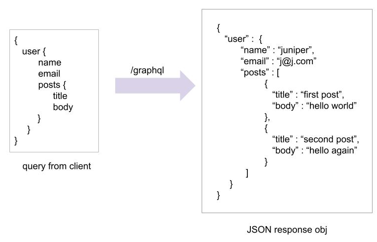

# GraphQL
My understanding of GraphQL, AWS Amplify

### Amplify 
It is a frontend library that makes it easier to talk to AWS backend resources. CLI and toolchain for client.

**`CLI`** Command Line Interface
- Create and configure AWS services directly from your front end environment or from your terminal.
- It also consists of Client Library
- Once you have created your services from CLI, you can use one of the client libraries to interact with services that were created by CLI.

```
What services are supported:
- Database
- API
- Lambda
- Auth
- Analytics
- Hosting
- Storage via S3
- Chatbots
```
### Authentication
For authentication, we need to specify authentication rules on our graphQL schema and we are going to need to add authorization rules for interacting with our graphQL API in general.
To do this, we need to steuo an authentication service
By using Ampplify, we can setup authentication using API category which under the hood utilized Amazon Cognito

***Amazon Cognito Service***
- It is a user management service
- It allows you to sign in or sign up and manage them - create and configure
- Using CLI you can configure new cognito resoirces from the client library
- You can interact with this user service by signing in or signing up and intracting with different mechaniscms needed for user management
- It consists of pre configured components for applications
- Once you create this service, you can use these components to get running with real user interfacr

***AWS App Sync Service***
- It is a management API Service
- It utilizes graphQL as its implementation
- From CLI, you can create AWS App Sync GraphQL APISs
- Once created, you can coonfigure or update or manage your API
- Base scheme can be evolved
- Using Amplify client library, you can then interact with the AppSync API, then you can query against it, send mutation, register or subscribe

### GraphQL?
`GraphQL` is a data language that was developed to enable apps to fetch data from APIs. It has a declarative, self-documenting style. In a GraphQL operation, the client specifies how to structure the data when it is returned by the server. This makes it possible for the client to query only for the data it needs, in the format that it needs it in.

### Why use GraphQL?
1. Fast and flexible
2. The client decided what data to recieve and not the server like what happens in REST
3. Fewer HTTP requests
4. Flexible data query and less code to maintain

### GraphQL query
<!--  -->

In this example, we have a graphQL query. In this query we are asking from graphQL server to give this particular user's name, email and posts that they have created. When you send this request, you get a request in JSON response. The JSON attributes is exactly matching to what the user has requested. The post is an array of objects. Each object contains title and body. 

If it was REST, we may have to get the user's name, email and ID first using one HTTP call to the server and then we may have to send the user's ID to a diff API endpoint to fetch all the post of that users. So it could have couple of request in order to formulate this type of data object.

In graphQL, we only have one API endpoint. For that API endpoint we send the query that we need. The client makes this query, the server will make sure to get whatever corresponding data from different data sources, different tables. In this case, it might have  queries these otwo field from user table and post from post table and aggregate it and send the response in form of JSON object that can be easily populated in the client.

### Main GraphQL Operation
**Query** \
Fetch the data from GraphQL API. Similar to GET request in REST.

**Mutation** \
Changing the data - CRUD operations - Create/Update/Delete. Similar to POST/PUT/DELETE.

**Subscription** \
Watching over changes in Real time. For example, we do a mutation - create a new post in post table, the clients can always listen to the post creation multation. So whenever a new post is added, the changes will be passed to the client in real time. This happens through WebSocket. The client is opening a WebSocket connection to the server and whenever a mutation is happening and client has a subscribed to that multation then it will receive real time data.

### Graph Transform 
- It is a series of directives or library of directives that allow you to decorate a base GraphQL type to add additional functionality.
- Provides an abstraction that helps you quickly create backends for applications on AWS.

**Types** \
`@version`
allows to have versioning in API

`@function`
allows you to specify a lambda function as your graphQL resolver. For example, people implement microservices or work on existing backend services that are not directly accesible from the applications at the moment. To do that it is easy to use a lambda function so we use @function resolver to add lambda function and have the response turned to graphQL.

`@searchable`
allows you to deploy an elastic search instance using a combination of at mode so you have dynamoDB funcationality, elastic searcg integrated directly to dynamoDB

`@model`
allows to take base type and decorate with this model fireld to scaffold out different functions for you based on pre configured specification
This can changed according to the use case and what they do with API
- CRUB, list operation
- resolvers
- generate the database
- generate subscription

For implementation:
1. Create queries for mutations in schema
2. Write resolver code that interacted from your operation into your data source
3. Setup datasource

But by using GraphQL,
1. Just add mode decorater and it generates everything
2. Take that and modify according to business logic

What @model adds:
- CRUD and list operations
- DynamoDB Table
- Subscriptions
- Resolvers for all operations

`@connection`
It enables relationship between model types
Specify an @connection between different types so under the hood it creates resolvers and everything 

**Next Steps** 
- Install, configure and init an Amplify project with Amplify CLI
- Define a GraphQL schema that we can use to provision backend resources, store data locally, sync to a cloud database, as well as receive updates over a realtime 
subscription.

**Learn More** \
Learn how to deploy an AWS AppSync GraphQL API and connect to it from a client application. The Amplify API category provides an interface for retrieving and persisting your model data. The API category comes with default built-in support for AWS AppSync. The Amplify CLI allows you to define your API and provision a GraphQL service with CRUD operations and real-time functionality.


_Amplify Ref https://docs.amplify.aws/_ \
_GraphQL https://graphql.org/learn/schema/_
